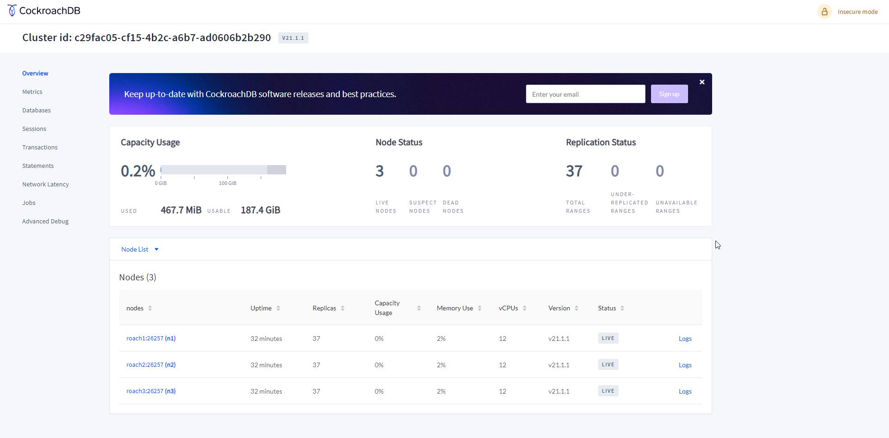

# <b>Simple Implementation of GORM + graphQL + CockroachDB </b>

## <b>Setup Cockroach DB </b>
First of all, we need to setup a Cockroach Database
#### `docker-compose.yaml`
<pre style="white-space: pre">
<code>version: "3.5"

# Reference: https://www.cockroachlabs.com/docs/v21.1/start-a-local-cluster-in-docker-linux
services:
    # Node 1 (main)
    roach1:
        container_name: cockroach-db-1
        image: cockroachdb/cockroach:latest
        hostname: roach1
        # Assign Container to a Network
        networks: 
            - cockroach-net
        ports:
            - 26257:26257   # Cockroach Database port
            - 9090:8080     # Cockroach UI Panel port
        volumes:
            - ./cockroach-data/roach1:/cockroach/cockroach-data
        command: start --insecure --join=roach1,roach2,roach3
      
    # Node 2
    roach2:
        container_name: cockroach-db-2
        image: cockroachdb/cockroach:latest
        hostname: roach2
        # Assign Container to a Network
        networks: 
            - cockroach-net
        volumes:
            - ./cockroach-data/roach2:/cockroach/cockroach-data
        command: start --insecure --join=roach1,roach2,roach3
        
    # Node 3
    roach3:
        container_name: cockroach-db-3
        image: cockroachdb/cockroach:latest
        hostname: roach3
        # Assign Container to a Network
        networks: 
            - cockroach-net
        volumes:
            - ./cockroach-data/roach3:/cockroach/cockroach-data
        command: start --insecure --join=roach1,roach2,roach3
    
    # First Time Initialization of Cockroach DB
    init-roach1:
        image: cockroachdb/cockroach:latest
        container_name: init-cockroach
        depends_on: 
            - roach1
        restart: "no"
        # Assign Container to a Network
        networks: 
            - cockroach-net
        entrypoint: ["bash", "-c" ,"./cockroach init --insecure --host cockroach-db-1:26257 | wc || exit"]

# Initialize a Network 
networks:
    cockroach-net:
        driver: bridge</code>
</pre>

Run this docker-compose file using command:
```
docker-compose up -d
```

After that, open http://localhost:9000 and it will show an UI Panel like this:



<!-- ## <b> Writing Our GraphQL Server </b> (Skip this part)

We will use https://github.com/99designs/gqlgen library to help us generate the server by running:
```
go get github.com/99designs/gqlgen
go run github.com/99designs/gqlgen init
```

and then we need to change the configuration file about the data types

#### `gqlgen.yml:45`
```
...
models:
  ID:
    model:
      - github.com/99designs/gqlgen/graphql.Int64  # this one
      - github.com/99designs/gqlgen/graphql.Int
      - github.com/99designs/gqlgen/graphql.ID
      - github.com/99designs/gqlgen/graphql.Int32
  Int:
    model:
      - github.com/99designs/gqlgen/graphql.Int
      - github.com/99designs/gqlgen/graphql.Int64
      - github.com/99designs/gqlgen/graphql.Int32
...
```

Move the `Int64` to the top. <br />So when we generate GraphQL Type `ID` it will give us `int64` instread of `string`.

And then run the generate command 
```
go run github.com/99designs/gqlgen
``` -->

## <b> Running Our GraphQL Server </b>

Environment file that I use:

#### `.env`
```
DB_HOST=localhost
DB_PORT=26257
DB_USER=root
DB_PASSWORD=
DB_DATABASE=defaultdb
```
The password is empty because the it is an insecure Database Initialization

Before we run the code, make sure the `.env` Successfully Connected when the program is running. <br />
Try this library to get the `.env` file https://github.com/joho/godotenv

To run the server, just simply run this command:
```
go run server.go
```
After that, check http://localhost:8080 , a graphQL Playground will come out. <br />
Try to run some of its mutation/query. 
<br />
<br />
<b>Mutation Example: </b>
```
mutation{
  user_create(input:{
    name: "My Name"
  }){
    id
    name
  }
}
```
response:
```
{
  "data": {
    "user_create": {
        "id": 663947492917903400,
        "name": "My Name"
    }
  }
}
```
<b>Query Example</b>
```
query{
  users{
    id
    name
  }
}
```
response:
```
{
  "data": {
    "users": [
      {
        "id": 663947492917903400,
        "name": "My Name"
      },
      {
        "id": 663949671822622700,
        "name": "Second User"
      }
    ]
  }
}
```
